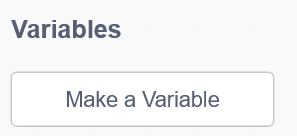
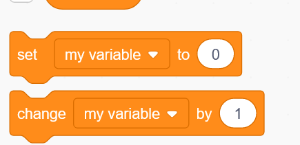
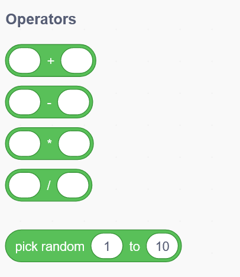
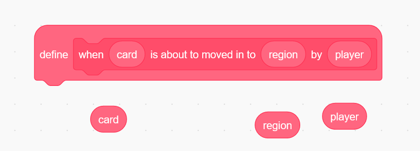
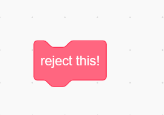

## 数据类型

卡牌表示(卡牌组)
- 一张张卡牌
  - 卡牌需要兼顾有可扩展性
  - 卡牌id
  - 卡牌效果
    - **如何描述卡牌效果?**
      - 直接使用文字来描述(拒绝保留关键词)
    - 如何规定卡牌结算?
      - 事实上,特殊的结算使用传递框,而卡牌自己只是让**行动**亮起并且能够被填入传递框罢了
    - !图形化函数结算所有的卡牌
    - **可扩展卡牌**
      - 扩展卡牌的实质时扩展行动和扩展传递框!
      - 扩展卡牌的实质就是让无声响应序列能够有判断条件!

- 区域
  - 区域类型
    - 手牌区域
    - 银行区域
    - 牌库区域
    - 牌堆区域
    - 视窗区域?(用于先知)?(应该不需要)
    - **可扩展区域**
  - 区域查看类型
    - 暗牌,明牌
    - (部分暗牌,部分明牌)

- ~~时机定义和扳机定义~~ 响应序列
  - 响应序列初始化
    - 由出牌顺序确定
    - 玩家死亡后依旧在序列中
    - 分为主动响应(询问响应)和被动响应
    - 玩家死亡后不能触发主动响应, 但被动响应依旧可以触发(前提如特殊区域卡牌死亡不丢弃)
  - 响应序列(移动事件)(细粒度)报文:
    - 移动相关区域
    - 被移动卡牌
    - 移动方向
    - 执行主体(谁来移动这个卡牌,如果是*系统*?就设置为0)
    - 被选择的对象(此处应该是不好修改的,甚至不应该时有效的信息)
    - 成功执行(>0为能成功,0为不能)(此处成功仅仅只代表是否能成功转移卡牌)
  - 响应序列(执行事件)(粗粒度)报文:
    - (往往在多次移动完毕后触发)
    - 在菜篮子.获取全部卡牌 和 菜篮子.传递成功全部卡牌后轮询
    - 被执行对象(一个人可以创建多个子响应序列.执行事件)
    - 执行对象
    - 行动编号(类似于ID,通过这一条取出 行动ID.效果名称)
      >xxx玩家发动了效果万箭齐发,你是否要打出否决?(执行事件->准备生成更多执行事件)
      >
      >xxx玩家的万箭齐发即将对你产生效果,你是否要打出否决?(子执行事件)
      >
      >xxx玩家的万箭齐发确实对你产生了效果,请打出闪或者掉血(事件)
    - 执行成功?(>0和0)

  - 自定义玩家响应:
    - 主动响应(在玩家面前弹出传递框的响应)
      - 内置响应:否决,反弹等响应执行事件
        >拖入一张否决
        >
        >移动事件响应序列 出 入 执行完毕
        >
        >执行事件(被开了一个) : 玩家x的否决即将起效,你是否要xxx?
        >
        >第一次响应结束, 玩家x继续可以继续出牌
      - 自定响应:更改目标?
        >类似于行动时指定目标
        >
        >响应时,拖动卡牌进入传递框,点击递交,传递框进行合法性检查
        >
        >之后选择一个角色, 生成一个响应序列后无疑结束, 更改原始行动指定的对象
        >
        >这种响应会在类似于否决响应的时候亮起, 可以点击并使用
      - 自定响应:更改数量??
        >这也太抽象了
      
      

- 传递框(菜篮子)(事实上是卡牌基础操作)
  - 元操作
    - 弃牌(直接到弃牌堆)
    - 使用(和弃牌名称不同)
    - 转移
    - 标记
    - 湮灭
    - 银行传递框(存&取)
    - ?自定义元操作
  - 点击确认后依次触发递交,依次触发响应序列
  - 自定义无法被操作的新卡牌传递框 (这些传递框因为不是从手上获取牌二十创建牌,所以不触发响应事件)
  - 环回问题
    - 当传递的src和dst是同一区域
    - (可能无需考虑环回问题)

- 行动
  - 自定义行动
  - 在满足了行动的内置前提后可以执行行动
  - 点击行动会弹出来多个传递框
  - 在满足了传递框后可以递交
  - 递交后按照行动的要求依次选择被执行人
  - 被执行人选择完毕后弹出(确认/取消)
  - 确认后开始执行,开始响应事件列
  -
  - 行动中带ctn ctn为0后无法再行动 ctn为-1为无穷次行动
  - 将一部分行动放入(完成这些行动后才能且立即回合结束)

- 标记
  - 卡牌标记的原因时为了给卡牌分某种组
  - 打上卡牌标记的时间
    - 在使用传递框操作某区域时
    - ?自动给某一类卡牌打上标记(如回合结束时给最后出的一张卡牌打上标记)

## 问题研究

打出二白时, 取1 取2 入1 入2 分别触发响应序列,最后时执行事件的响应

出现"尸体在打牌该怎么办?"
>1打出二白
>
>白1出 白2出 白1入 白1触发了炸弹!
>
>炸弹入1手牌,1发现了,必须在这一个响应之内拆弹
>
>(拆弹成功)1在传递框内拖入拆解, 拆解出, 拆解入, 拆解生效, 拆解生效:使炸弹.成功执行 降低1/变为0, 拆解生效:使炸弹移动到其他位置, 炸弹响应结束, 继续白2入, 执行2白效果
>
>(拆弹失败)1无拆解, 炸弹在一个轮询后成功触发, (死亡结算开始)宣告1死亡(触发轮询,亡语阶段,死亡侦测阶段), (真实死亡阶段)1所有手牌出, 1所有手牌入, 清除1的令牌桶, 更改1的响应为被动(死亡结算结束)
>
>继续白2入, 执行事件在执行前轮询了1自己, 1死亡, 更改此二白.成功执行 = 0 后续的轮询都是:"1的xxx行动即将失败"

## 游戏流程

游戏开始
- 选择英雄/自定义英雄
- 摸牌(系统直接帮忙摸)(此处考虑:摸到炸弹后放回or直接无炸弹摸牌)
- 选出白板猫作为银行

其他人回合
- 其他人打出卡牌后,会轮询每个玩家是否要打出响应(类似于三国杀)
  - 无法响应的玩家也有回合结束计时条,但倾向于2s内结束掉
  - 响应可以嵌套子序列如
    >1打出功能牌 (1在此暗响应) 2跳过 3打出否决 
    >
    >以3打出的否决接着创建一次序列,(3暗响应) 4跳过(不否决3的否决) 1跳过 2跳过 子序列结束
    >
    >继续结算1创建功能牌的子序列 此时4依旧可以响应1的功能牌
  - 响应可以处理(小猫钓鱼)
  - 使回合结束也会创建一个响应序列(处理拾荒)
  - 响应序列可以处理帮助(其他玩家都跳过而某玩家不跳过)
  - 响应序列理应分为无声响应序列和显式响应序列
    - 无声响应序列处理(拾荒, 帮助)等等效果明确,不会因为无声而提供信息的序列, (特点是没有决策的空间, 倒计时结束后必须要选择一个交出)
    - **响应序列是否无声可以让玩家自定??**
    - 无论是有声还是无声响应序列都可以开启子响应序列
    - 例如帮助会开启响应序列1:玩家b失去某手牌,接着开启序列2:玩家a得到某手牌

自己回合
- 以其他人的\[回合结束\]作为自己回合开始的标志
- 出牌
  - 如何确定玩家将要进行的行动?(如出一白究竟是想要拆除掉一个人的陷阱或是一个人的钓饵?)**指定行动和指定区域**
  - 目标选择是在什么时候? (如何促进区域内的目标选择?)
    - 自定区域无法被选为目标,只能在出牌前点击"特殊动作"
    - 自定行动无法被匹配识别,只能先点击自定行动(然后在传递框内拖入符合要求的牌 系统对这个传递框进行检查)
    - 系统定义的卡牌组合(单走攻击等)区分为定向和非定向
    - 定向卡牌: 拖入传递框,此时:传递框.执行事件=0,检测传递框内的卡牌是否与某种预置模式相匹配,更改传递框的执行事件, 接着, 等待设置执行的目标(目标理应是区域,且非自定义区域)(可以多次设置目标), (确认or取消 设置的目标), 点击执行(传递框依次出发), 轮询结束, 传递框到达, 轮询结束, 效果触发, 

  - 自定义传递框
    - 如果要求是 出一张白+湮灭一张功能+和银行交换一张+给其他一个玩家一张牌 **此时传递框需要能够分为四个组件,并且四个组件要达到"一起匹配,一起出发"**
  
  - 自定义传递框匹配表达式
    - 被诅咒卡牌(拥有蓝色标记)(新申明标记,标记动态分配颜色,标记放在卡牌左侧)
    - 新增 <拥有(x)标记的卡牌> 的匹配

  - 区域互动效果
    - 如何判断是否应该能够看到卡牌?
    - 自摸(int)数量卡牌 **注意,在线上,暗牌自摸和随机给没有任何区别**
    - 在(area)区域中的 满足(class1 or class2)的所有卡牌中自摸
    - 如何处理抉择操作?(弃掉人家2张或者是自己摸走一张?)
      - 考虑用传递框表达操作
      >\[操作1\[弃牌\[卡牌1,卡牌2\]\]\]
      >
      >\[操作2\[获得(转移至自己手牌中)\[卡牌1\]\]\] 
      - 传递框表达式可以使用小箭头来切换操作

    - 如何处理多玩家操作?(选择一个玩家让他弃一张,另一位玩家弃两张)
      - 多玩家操作时, 操作名直接在指定操作区域时便加以区分(lor的7费慢速弹幕)
      - 对某个区域的执行

    - 如何给卡牌添加标记?(使一张卡牌变为被诅咒的卡牌!)
      -卡牌标记必须要能够覆盖掉原先的预置(被诅咒的卡牌或许就不能直接打出了)
      - 拖入一张卡牌到传递标记框内并打上标记
      - 标记中, 定义其所有者新增加的行动
      - 想要打出被诅咒的卡牌必须要能够献祭一张白卡怎么办?
        - 每个玩家都可以找到所有的已注册行动(别人给自己注册的也在内,甚至别人给别人自己注册的也在内 这便是整局游戏的全部行动)
        - 别人的行动在\[主控者非自己\]时被隐藏, 其他行动在不满足条件时被隐藏(可以点击查看全部行动,然后鼠标移上去看看需要满足哪些条件(可以直接看代码吗))
        - 而一旦手牌中出现了"诅咒"卡牌, 那么某条件被满足了, 对应的行动也被打开了

    - 如何给某玩家手上塞入新卡牌?(自定义自伤卡牌!)
      - 定义一个无法修改且已经预置了某新卡牌的传递框, 这个传递框传递的对象区域来源于行动的指定

    - **添加标记/添加卡牌 更要能够添加玩家可以进行的动作!**(因为是非预置卡牌)

- 与银行做交换
  - 交换时点击(交易行动(交易行动如何限制回合次数?:每个行动都要设置(无限次/有限次)))
  - 出现传递框
  - 拖入任意可以被放入传递框的卡牌(如何设置"不能放入银行传递框?")

- 回合结束摸牌
  - 回合结束必须要完成一些动作, 完成这些动作之后必然回合结束
  - 回合结束按钮 进入准备回合结束动作
    - 准备回合结束时不能使用回合结束框外的任何动作

- 令牌桶
  - 死亡时在令牌桶中删除玩家
  - 令牌桶:一般回合
    - 回合结束时, 把令牌桶\[0\]移除,然后在队尾加入自己
  - 令牌桶:被攻击回合
    - 回合结束时, 把令牌桶\[0\]移除
  - 令牌桶:插入行动
    - 回合结束, 回合结束轮询结束
    - 新回合, 行动回合, 行动回合轮询开始
    - 被轮询到的人执行行动并继续触发轮询
    - 行动如将aaa的手牌给bbb一张
    - **因此很可能需要在左上角标明令牌桶情况**

- 摸到炸弹猫
  - 进入摸到炸弹猫轮询
    - 轮询中, 自己的(拆解行动)亮起
    - 点击拆解行动后,出现传递框:
      >\[抽到炸弹\[炸弹(不可移动)\[炸弹1\]\]\] \[拆解\[拆解1\]\]\]
    - 放入拆解并递交后产生 拆解离开手牌+拆解进入弃牌堆 + 炸弹离开手牌+炸弹回到牌库 的响应序列
    - 拆解结束后,玩家继续回合结束
    - 编辑令牌桶
  - 轮询结束后无意外玩家死亡(death())
  - 死亡后一个死亡篮子弃掉所有手牌(甚至会包括弃牌时触发效果的卡牌)
  - 玩家离开令牌桶(令牌桶强制删除玩家)
  - 玩家的主动响应序列默认不触发(无动作)

- 摸到任意卡
  - 任意卡的摸到效果在轮询时触发
  - 因此自定义卡牌理应定义轮询
    >1摸到自定义卡,2可以在这次轮询后触发效果
    >
    >1先触发摸到卡牌的效果,2再触发效果

# 图形化部分实现

以形状代表数据类型
- 我们这里没有任何list set 或者是 dict, 无需考虑索引和取值问题, 无需考虑index error

**不允许报错!**

需要有
- 玩家 (game 表示了自然造物)
- 区域
- 卡牌
  - 卡牌信息
  - tag 与 卡牌种类
- 数量 int(?)
- 标签

相容链条
- 玩家>区域(直接在区域中放入玩家类型指的是玩家的手牌)
- 数量
- 卡牌(卡牌中的标签?attribution的概念如何在图编里体现?)
- 卡牌信息+比较运算符 => tag 和 卡牌种类

### 数量 与 运算

数量是横向可扩展圆角矩形

新变量的定义:

在单击后会跳出来一个框,定义好的新变量放在左侧列表中

整形数量操作

使用一样的形式

(注意,一定要确保在删除某变量的时候要删除所有和该变量有关的副本)

运算系列

**特殊意义整型**

响应序列.成功执行?

### 区域问题

默认区域:
- 我的手牌
- 银行
- 牌堆
- 牌库
- 任意玩家的手牌

### 响应序列问题

一共分为两种响应序列:移动响应和执行响应

移动的创建:**move语句**

move
- exact num
- up to (2)
- more than (1)

cards that satisfies
- (条件句)
- chosen by someone blindly
- chosen by someone

from
- region
- random ()
- voidness

to
- region
- voidness

统一头为:when a {card}(可以被拿出来用) \[is about to/ has been\] move(d) \[out from/in to\] {region}(可以被拿出来用) by a {player}

**在about to move 中**

可以使用reject this 来创建一个执行响应序列并在成功时将此次移动取消

reject all of this 指的是不但取消这一次行动,而且取消一切后续行动!

**通用**

可以在这个时间加以判断然后move任何卡牌

卡牌筛选 & 判断

(card) is (upside down / attached by (blue tag))

### 行动(响应)

I \[can/have to\]
- move
- attach tag
- do sth

if I (have to 的时候就没有if I了)
- move sth
- attach tag on (card) of (region)
- etc

when
- \[someone move/play (sth表达式)/my turn\]\&\&\&\&\&I hold (num) card(s) satisfy (表达式)

### 卡牌表达式

卡牌信息
- 进入场地回合
  - 游戏需要记录现在是第几回合  
  (每当回合结束,则增加计数器,攻击无意外会多增加计数器)
- 创造者
  - 如果是原始卡牌,则标记为 Game
- 当前朝向
  - 正面
  - 背面
  - 对自己背面而对其他人可见
  - 对自己正面而对其他人不可见

卡牌元件
- 全部(任意)
- 攻击 / 跳过 / 否决 / 多毛 等等
- 功能牌 / 白板牌 / 自定义卡牌
- has tag (与 *卡牌信息 + 比较*)
  - (进入回合) = (当前回合 - 1)
  - 标记 (被诅咒, 只能使用自己定义的标记)

卡牌连接件
- 和 (*攻击 和 跳过* 表达了需要两张卡牌)  
- 且 (*白板 且 tag* 表达了需要一张卡牌)  
(*白板 且 功能* 则会永远无法匹配,菜篮子永远不能亮起)
- 或 (*攻击 或 跳过* 表达需要一张)
- 非

### 区域表达式

区域元件
- 全部(任意)
- 银行
- 牌库
- 牌堆
- 玩家手牌
- 自己手牌
- 自己的自定义区域

区域连接符
- 和 (同样, 表达了需要两个区域)  
**思考:在指定区域的时候,真的有必要这么搞吗?**
- 且 (表达了需要一个同时满足两个条件的区域)
- 或 (表达了满足左条件或右条件的区域)
- 非

### 玩家操作

玩家指定场地
- 选择多个区域,并且系统比较区域是否合规
- 右侧有 (取消/确认) 确认只有在选择区域合规才能亮起

玩家索取卡牌
- 系统出现ui
- 选择的卡牌相当于是选择了一个卡牌元件
- 此处没有菜篮子,选择一张卡牌后点击确认,就会索取卡牌
- **广播,xxx索取卡牌xxxx**  
(这个怎么做?)

玩家放回炸弹
- 抽到炸弹
- 跳出传递框  
传递框左侧是刚刚抽到的炸弹,右侧要放入拆解  
或者在此处使用特殊响应,行动高亮
- 成功递交, 跳出ui, 可以将卡牌塞入
- **广播或是不广播,xxx将卡牌放到了xxx位置**

玩家切牌
- 跳出ui
- 选择位置,分为上下两叠,交换位置
- **何时判断需要结束?**
- **广播或是不广播执行结果**

